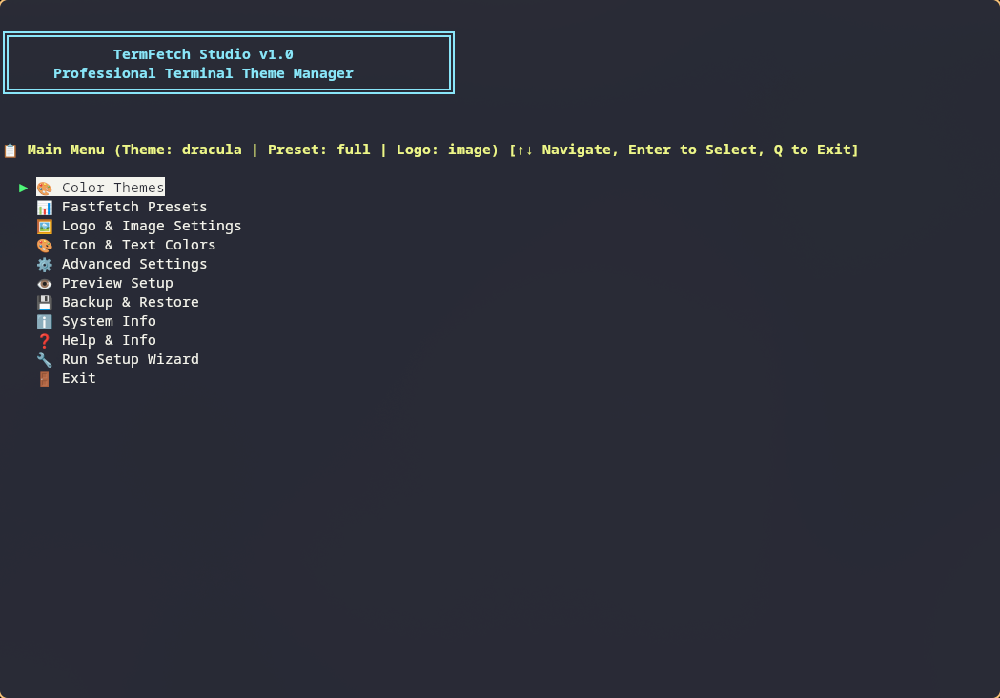
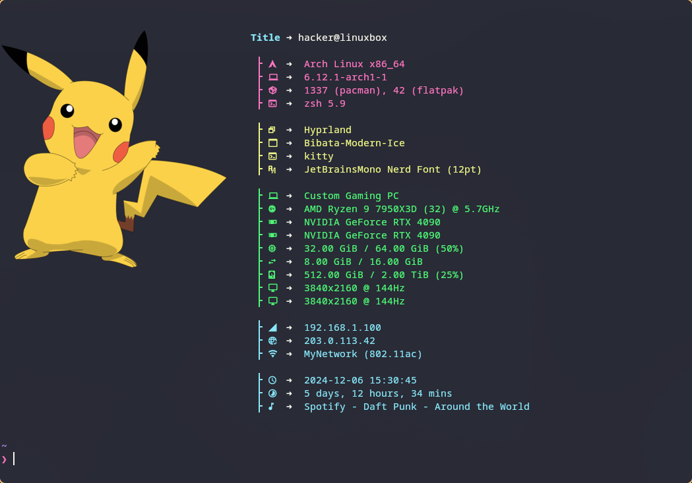

<div align="center">

# TermFetch Studio

**An interactive terminal theme and fastfetch manager for Linux.**

Choose themes, organize system information and personalize your terminal with image or ASCII logos.

[](LICENSE)
[](CHANGELOG.md)
[](#requirements)

[Quick start](#quick-start) · [User guide](docs/USER_GUIDE.md) · [Changelog](CHANGELOG.md) · [Release notes](docs/RELEASE_NOTES.md) · [Report a bug](https://github.com/sinansarikaya/termfetch-studio/issues)



</div>

## Why TermFetch Studio?

Terminal customization often means editing several configuration files. TermFetch Studio brings theme selection, fastfetch presets and logo configuration into one keyboard-driven interface.

Built and used daily by [Sinan Sarıkaya](https://sinansarikaya.dev).

## Features

- **Themes and previews:** choose built-in color schemes or create a custom theme.
- **Fastfetch presets:** select system-information modules, customize colors and reorder custom presets.
- **Image and ASCII logos:** personalize the output to suit your terminal's capabilities.
- **Shell integration:** configure startup output for Bash, Zsh or Fish.
- **Configuration tools:** preview your setup, create backups and restore saved settings.

<p align="center">
  
</p>

## Version and project status

The application currently reports **1.0.0**. The repository includes later changes from October and December 2025 that did not increment that version.

There are currently no published GitHub Releases or tags. See the [changelog](CHANGELOG.md) for dated history and the [prepared release notes](docs/RELEASE_NOTES.md) for the existing 1.0.0 code baseline.

The project is being prepared for a maintenance pass. Known bugs are being collected; this documentation update does not change application behavior. Backup, restore and terminal compatibility need further validation before broader support claims.

## Requirements

- Linux and Bash to run the installer and application.
- fastfetch; the installer offers dependency installation.
- A Nerd Font configured in your terminal for the intended icon display. See [font setup](FONT_SETUP.md).
- Optional image tools such as chafa and ImageMagick.

Bash, Zsh and Fish are shell-integration targets; the application itself runs in Bash. Colors and image rendering depend on the terminal. The [user guide](docs/USER_GUIDE.md) records existing compatibility guidance, not a newly verified test matrix. macOS support has not been validated in this maintenance pass.

## Quick start

Review [install.sh](install.sh) before running it. Run the installer as your normal user; dependency installation may request sudo.

```bash
git clone https://github.com/sinansarikaya/termfetch-studio.git
cd termfetch-studio
bash install.sh
termfetch-studio
```

If the command is not found, run `~/.local/bin/termfetch-studio` and add `~/.local/bin` to your shell's PATH.

**Navigation:** arrow keys to move, Enter to select, Q to go back.

## Commands

| Command | Purpose |
| --- | --- |
| `termfetch-studio` | Open the interactive menu |
| `termfetch-studio --preview` | Show the current setup |
| `termfetch-studio --version` | Show the application version |
| `termfetch-studio --help` | Show command help |
| `termfetch-studio --backup` | Create a configuration backup |
| `termfetch-studio --restore` | Select a backup to restore |
| `termfetch-studio uninstall` | Run the installed uninstaller |

Keep an independent copy of important configuration files while backup and restore behavior is under review.

## Configuration

| Location | Contents |
| --- | --- |
| `~/.local/bin` | Application commands |
| `~/.local/share/termfetch-studio` | Installed application files |
| `~/.config/termfetch-studio` | Settings, images and backups |

See the [user guide](docs/USER_GUIDE.md) for themes, presets, logos, demo mode and troubleshooting.

## Contributing and feedback

Bug reports are especially useful during the maintenance pass. Include:

- Linux distribution, terminal and shell versions.
- TermFetch Studio and fastfetch versions.
- Steps to reproduce, expected behavior and actual behavior.
- Relevant error output or a screenshot, with personal information removed.

Theme contributions are welcome: include the theme file, a preview and the terminal used to test it.

## Next steps

The next maintenance milestone focuses on reproducible bugs, installation, backup and restore, and accurate compatibility documentation. A version and release date will be assigned after fixes are validated.

## License and credits

[MIT](LICENSE). Built on [fastfetch](https://github.com/fastfetch-cli/fastfetch), with thanks to the terminal theme and Nerd Fonts communities.

Created by [Sinan Sarıkaya](https://github.com/sinansarikaya).
